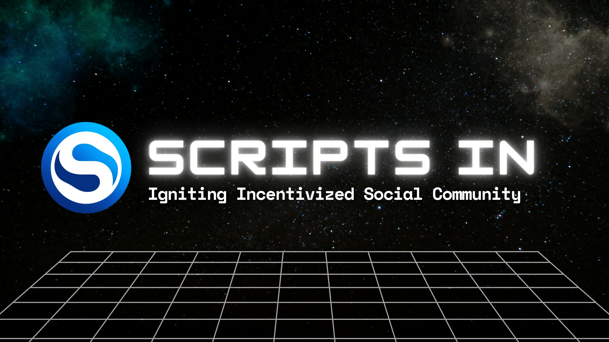
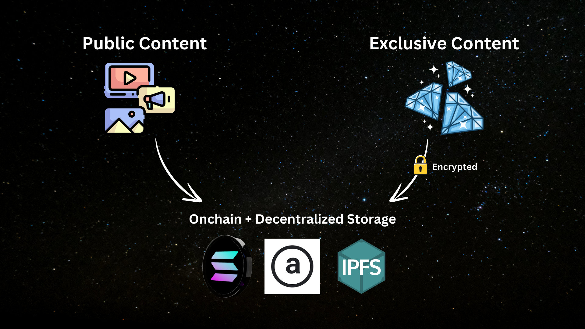
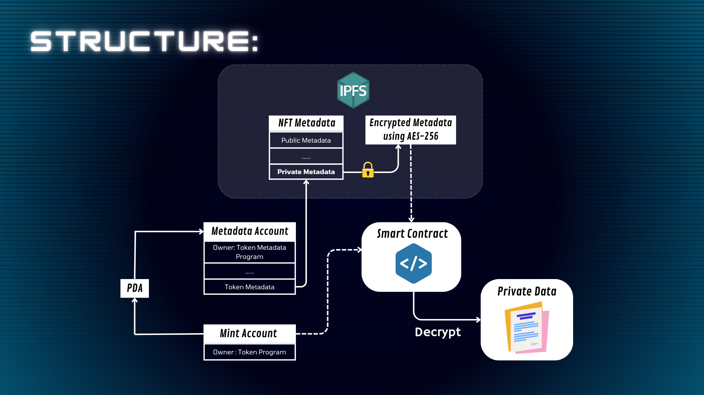
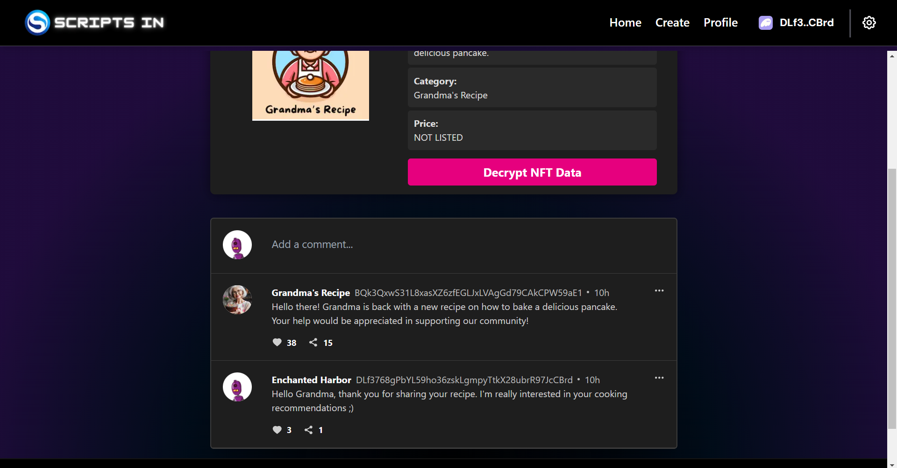
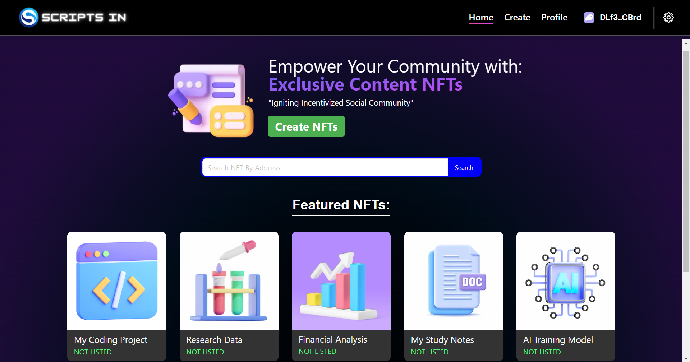
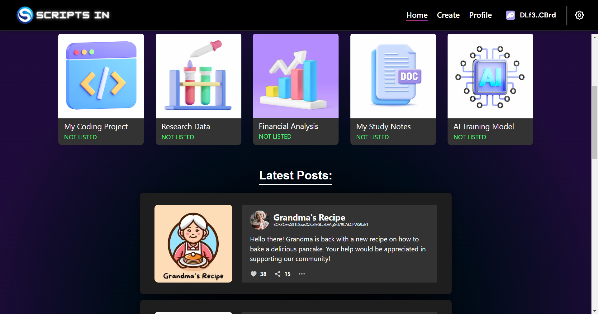
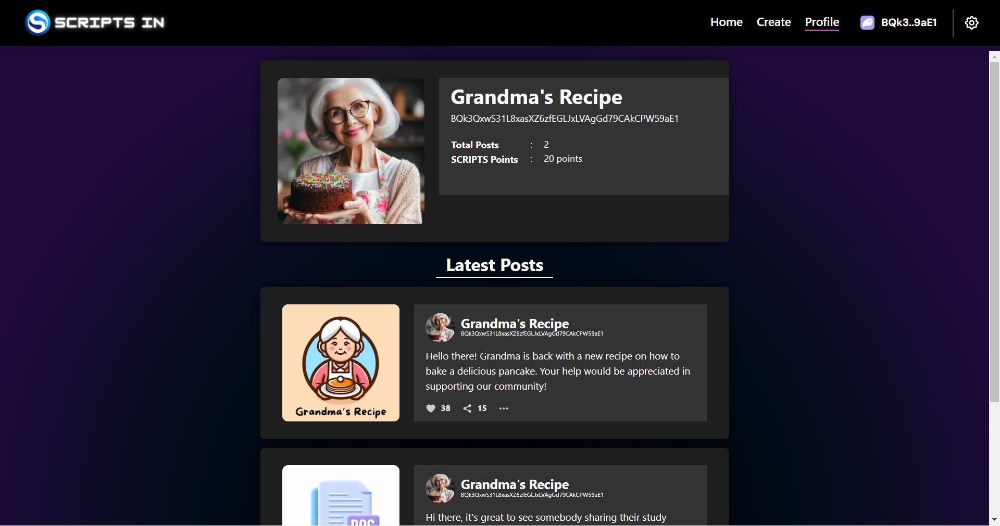
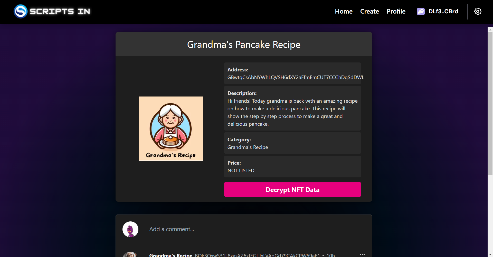
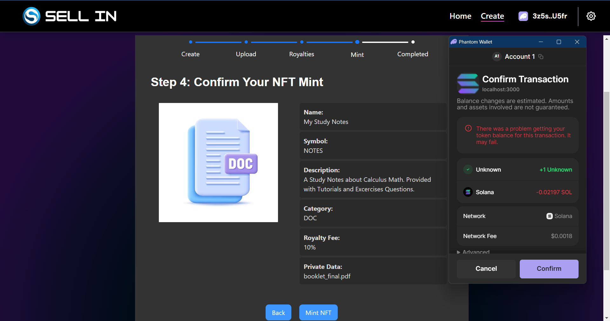

# Scripts In

 

Scripts In is a Social-Fi protocol for creators to build their community and sell exclusive content through NFTs. By combining on-chain and decentralized storages, users would buy NFTs from creators to gain access to the content.

The protocol also rewards both users and creators based on their platform activities with SCRIPTS Points. The system would encourage users to actively interact within the community to gain more SCRIPTS points.

## Links:
- [Demo Video (1 minute)](https://youtu.be/MtgrcHBjI4M)
- [Pitch Video (3 minute)](https://youtu.be/Yi7RLjt4C-A)
- [Link Tree](https://linktr.ee/scripts_in)

## Empowering Encrypted NFTs for Exclusive Social Network Protocol:


Scripts In uses both on-chain and off-chain storage to store its protocol data.



## Script Points


Scripts Points, stands for Share, Create, React, Invite, Post, Trade, Sell.

Users and creators would be rewarded with this points for their activities.
This system would promote community competition to be active in the protocol to earn more points, so they could earn rewards in the future projects. This would boost the activity within the community & ecosystem.

The protocol revenues will then be used as community rewards for users based on their accumulated points, such as airdrops, rewards & benefits, as well as potential SCRIPTS IN token launch after its protocol's success.

## Social Community

This social platforms let creators build their online community to promote their exclusive contents.




## Display

SCRIPTS IN Home Page
 
 

User Profile
 

Example NFT On Sell In
 

Minting NFTs On Sell In


*This Project Uses [Solana DApp Scaffold](https://github.com/solana-labs/dapp-scaffold/)

## Getting Started

This is a [Next.js](https://nextjs.org/) project bootstrapped with [`create-next-app`](https://github.com/vercel/next.js/tree/canary/packages/create-next-app).

The responsive version for wallets and wallet adapter may not function or work as expected for mobile based on plugin and wallet compatibility. For more code examples and implementations please visit the [Solana Cookbook](https://solanacookbook.com/)

## Installation

```bash
npm install
# or
yarn install
```

## Build and Run

Next, run the development server:

```bash
npm run dev
# or
yarn dev
```
